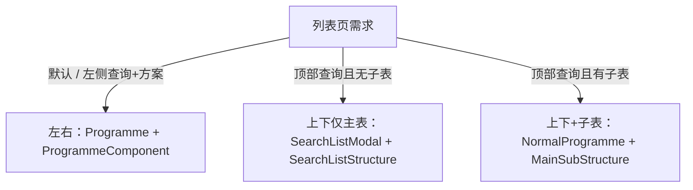

# jumai-utils 业务页面基建

任意业务项目（不限仓库）只要 `package.json` 依赖 `jumai-utils`，搭建或改页面必须遵循本 skill。
先读本文件做选型，再按需打开同目录参考文件。

## 硬性约束

- UI 基建一律用 `jumai-utils` 已有封装，不要用 antd `Modal` 做全屏层，不要手写左右/上下查询+表格布局。
- 文件命名、目录习惯跟随**当前业务项目**已有页面（`store.tsx` / `model.tsx`、是否拆 `constant.tsx`），不要另起一套。
- 查询方案 `moduleName`、表格 `gridIdForColumnConfig` 必须全局唯一，禁止复制粘贴成 `xxx`。
- 下拉 `data` 的 `value` 必须是 **string**。
- import：`import { Programme, ProgrammeComponent, request } from 'jumai-utils'`；类型 `BaseData` / `PaginationData` 也从 `jumai-utils` 引。

## 提示词 → 选型（默认走第一条）

用户没说结构时，默认 **左右结构 + 仅主表**。

| 用户怎么说 | 用什么 | 参考 |
|---|---|---|
| 左右 / 左侧查询 / 带方案 / 管理列表页（默认） | `Programme` + `ProgrammeComponent` | [list-layout.md](list-layout.md) |
| 上下 / 顶部查询，**只要主表** | `SearchListModal` + `SearchListStructure` | [list-layout.md](list-layout.md) |
| 上下 / 顶部查询，**还要子表** | 自己拼 `NormalProgramme` + `MainSubStructure`（禁止用 `SearchListStructure`，它内部强制 `hiddenSubTable: true`） | [list-layout.md](list-layout.md) |
| 弹窗里的筛选 | `NormalProgramme` + `NormalProgrammeComponent` | [list-layout.md](list-layout.md) |
| 顶部 Tab + 横向筛选 | `TabsProgramme` + `NormalProgramme`，或业务自定义 Tab 再套 `SearchListStructure` | [list-layout.md](list-layout.md) |
| 主子表 / 子表 / 明细 Tab | `MainSubStructureModel.subTables`，不要 `hiddenSubTable: true` | [main-sub-table.md](main-sub-table.md) |
| 只要主表 | `hiddenSubTable: true` | [main-sub-table.md](main-sub-table.md) |
| 表格上方按钮 | `MainSubStructureModel.buttons`（主表）或子表 `buttons: (subTable) => IButton[]` | [main-sub-table.md](main-sub-table.md) |
| 汇总（按钮上方） | `collectData` | [main-sub-table.md](main-sub-table.md) |
| 表尾合计 | `grid.summaryRows` / `sumColumns` | [main-sub-table.md](main-sub-table.md) |
| 全屏弹窗 | `FullModal` | [other-components.md](other-components.md) |
| 导出 | `ExportStore` + `ExportModal` | [other-components.md](other-components.md) |
| 导入 | `ImportModel` + `ImportModal` | [other-components.md](other-components.md) |
| 权限按钮 / 行内权限 | `pageId` + `permissionId`，或 `<Permission>` | [other-components.md](other-components.md) |
| 表格图片 / 时间戳 | `ImgFormatter` / `TimeStampFormatter` | [other-components.md](other-components.md) |
| 图片预览 | `ImagePreviewModal` | [other-components.md](other-components.md) |
| 批量结果 | `BatchReport` | [other-components.md](other-components.md) |
| 查询项类型 | 见 [filter-items.md](filter-items.md) | |

## 建页步骤

1. 用上面的表确定布局和是否有子表、按钮、汇总。
2. 查当前项目同类页面的文件拆分方式，按同样方式建 `index.tsx` + store/model。
3. 写 `filterItems`（[filter-items.md](filter-items.md)）和 `columns`。
4. 写 `api.onQuery`：主表拆 `filterParams` 后 POST；响应必须是 `PaginationData`（`data.list` + `data.totalCount`）。
5. 有子表就配 `subTables`；有按钮就配 `buttons`；有汇总就配 `collectData`。
6. `index.tsx` 只挂对应 Component，不要再包一层自己的 layout。

## 常用取值（store 内）

左右 `Programme`：

- 查询：`this.programme.handleSearch()` / 参数：`this.programme.filterItems.params`
- 动态下拉：`this.programme.filterItems.addDict({ field: [{ value, label }] })`
- 改查询项：`this.programme.filterItems.updateFilterItem([{ field, value }])`
- 主表勾选：`this.programme.gridModel.gridModel.selectRows` / `selectedIds`
- 主表当前行：`this.programme.gridModel.gridModel.cursorRow`
- 刷新主表：`this.programme.gridModel.gridModel.onRefresh()` 或 `this.programme.gridModel.onQuery()`
- 刷新子表：`this.programme.gridModel.subTablesModel.cursorTabModel.onRefresh()`

上下 `SearchListModal`：把上面的 `programme` 换成 `searchListStore.programme`，`gridModel` 换成 `searchListStore.grid`。

## 延伸阅读

- 左右/上下完整模板：[list-layout.md](list-layout.md)
- 主子表、按钮、汇总、子表查询：[main-sub-table.md](main-sub-table.md)
- 查询项 type 与字段：[filter-items.md](filter-items.md)
- FullModal / 导出导入 / 权限 / 预览等：[other-components.md](other-components.md)
